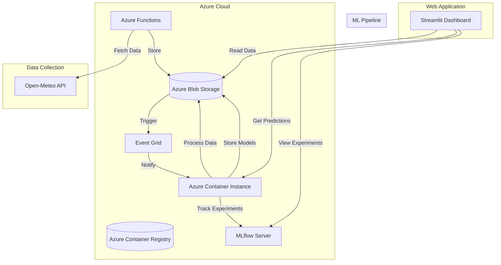
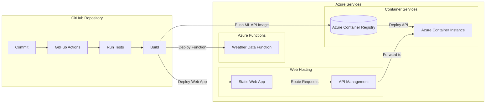
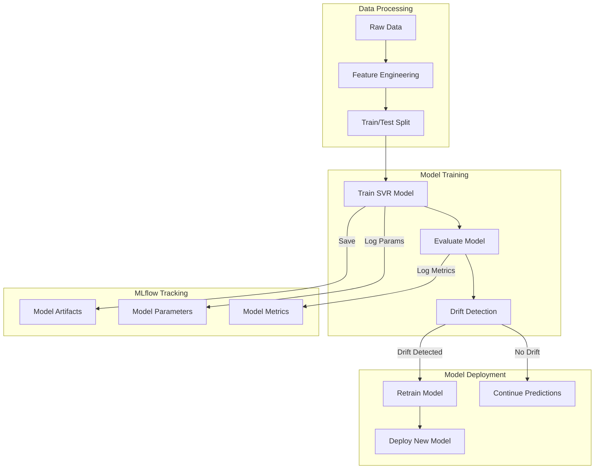
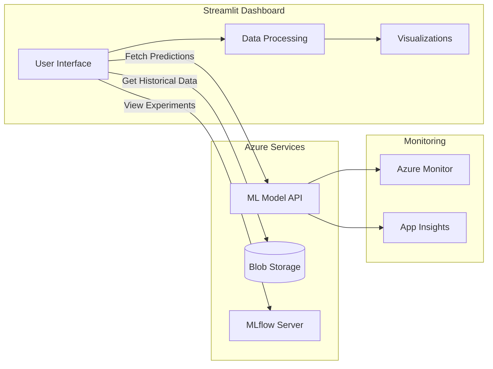
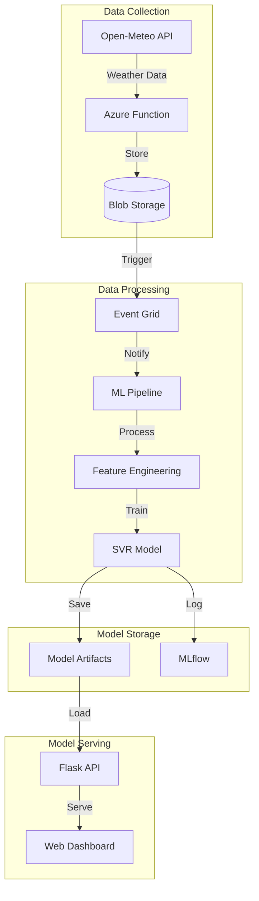

# Weather Forecasting MLOps Project

An end-to-end machine learning operations system that collects weather data, performs predictions, detects model drift, and automatically retrains when needed. The system leverages Azure Cloud services, MLflow for experiment tracking, and modern ML practices.

## System Architecture

### Key Components:

1. **Data Collection (Azure Functions)**
   - Scheduled historical data collection (monthly)
   - Daily forecast data collection 
   - Event Grid integration for triggering ML pipeline
   - Location: [azure_function/](azure_function/)

2. **ML Model Service (Flask API)**
   - Inference endpoint
   - Drift detection
   - Model retraining orchestration
   - Location: [ml_model/](ml_model/)

3. **Training Pipeline**
   - Support Vector Regression (SVR) model
   - MLflow experiment tracking
   - Feature engineering pipeline
   - Location: [weather_training/](weather_training/)

4. **Web Dashboard**
   - Interactive weather visualization
   - Model performance monitoring
   - Historical data analysis
   - Location: [weather_app/](weather_app/)

### Overall System Architecture


### CI/CD Pipeline Architecture


### ML Training Pipeline


### Web Application Architecture


### Data Flow Pipeline


## Setup & Installation

### Prerequisites

```bash
# Core Python packages
pip install -r requirements.txt

# Azure Function dependencies
cd azure_function
pip install -r requirements.txt

# ML Model API dependencies
cd ml_model
pip install -r requirements.txt

# Web App dependencies
cd weather_app
pip install -r requirements.txt
```

### Environment Variables

Required environment variables:

```bash
# Azure Storage
AZURE_STORAGE_CONNECTION_STRING="your_connection_string"
AZURE_STORAGE_ACCOUNT="your_account_name"

# Azure Functions
AZURE_CLIENT_ID="created_automatically_from_azurefunction_deploymentcenter"
AZURE_TENANT_ID="created_automatically_from_azurefunction_deploymentcenter"
AZURE_SUBSCRIPTION_ID="created_automatically_from_azurefunction_deploymentcenter"

# MLflow Configuration
MLFLOW_TRACKING_URI="your_mlflow_uri"
MLFLOW_EXPERIMENT_NAME="WeatherModelTraining"

# Azure Container Registry
AZURE_CREDENTIALS="azure_rbac_credentials"
ACR_NAME="your_azure_registry_name"
ACR_USERNAME="registry_username"
ACR_PASSWORD="registry_password"
RESOURCE_GROUP="your_resource_group_name"
LOCATION="resources_location" # E.g. canadacentral

# API Endpoints
ML_API_URL="your_api_endpoint"
```

### Local Development

1. **Azure Functions**:
   ```bash
   cd azure_function
   func start
   ```

2. **ML Model API**:
   ```bash
   cd ml_model
   python app.py
   ```

3. **Web Dashboard**:
   ```bash
   cd weather_app
   python streamlit_app.py
   ```

## Project Structure

```
├── azure_function/        # Azure Functions app
│   ├── function_app.py    # Function triggers
│   └── requirements.txt
├── ml_model/              # ML service
│   ├── app.py             # Flask API
│   ├── train_model.py     # Training pipeline
│   ├── inference.py       # Model inference
│   └── detect_drift.py    # Drift detection
├── weather_app/           # Web dashboard
│   ├── streamlit_app.py   # Streamlit interface
│   └── utils/            
└── weather_training/      # Training scripts
    └── weather_svr.py     # SVR model implementation
```

## ML Pipeline Details

### Feature Engineering
- Date-based features (month, day)
- Seasonal encodings
- Standardization of numerical features
- One-hot encoding of categorical variables

### Model Training
```python
# SVR hyperparameters
svr_params = {
    'C': [1e1, 1e2, 1e3, 1e4],
    'epsilon': [1.0, 1.2, 1.5, 1.8],
    'gamma': ['scale']
}
```

### Drift Detection
- Kolmogorov-Smirnov test on feature distributions
- Threshold-based drift detection
- Automatic retraining triggers

## Deployment

The project uses GitHub Actions for CI/CD:

1. **Azure Functions**:
   - Workflow: [.github/workflows/main_weatherdata.yml](.github/workflows/main_weatherdata.yml)
   - Deploys to Azure Functions service

2. **ML Model API**:
   - Workflow: [.github/workflows/deploy.yml](.github/workflows/deploy.yml)
   - Builds Docker container
   - Pushes to Azure Container Registry
   - Deploys to Azure Container Instances

## Monitoring & Maintenance

### MLflow Tracking
- Model metrics (RMSE, MAE, MAPE)
- Training parameters
- Artifact versioning
- Experiment history

### Azure Monitor Integration
- Function execution logs
- API performance metrics
- Storage analytics

## Best Practices Implemented

1. **MLOps**:
   - Automated training pipeline
   - Version control for models
   - Drift detection
   - Experiment tracking

2. **Code Quality**:
   - Modular architecture
   - Error handling
   - Logging
   - Configuration management

3. **Cloud Native**:
   - Serverless functions
   - Container deployment
   - Blob storage
   - Event-driven architecture

## Troubleshooting tips

- Azure Setup Guide: Please check the document in [docs/Azure_Setup_Guide.docx](docs/Azure_Setup_Guide.docx) for more information.
- Blob access: verify `AZURE_STORAGE_CONNECTION_STRING` / `AzureWebJobsStorage`.
- MLflow: verify `MLFLOW_TRACKING_URI` and container/experiment permissions.
- Azure Functions: local settings `local.settings.json` is ignored by `.funcignore` and `.gitignore` — ensure it's set locally for development.
- Python versions: ML artifacts reference Python 3.12 — ensure local/container environments align.

## Useful files (quick links)

- Azure function app: [azure_function/function_app.py](azure_function/function_app.py)
- Azure function requirements: [azure_function/requirements.txt](azure_function/requirements.txt)
- Flask ML API: [ml_model/app.py](ml_model/app.py)
- Training & retrain: [ml_model/train_model.py](ml_model/train_model.py) and [weather_training/weather_svr.py](weather_training/weather_svr.py)
- Inference: [ml_model/inference.py](ml_model/inference.py)
- Drift detection: [ml_model/detect_drift.py](ml_model/detect_drift.py)
- Blob helpers: [ml_model/utils/blob_helpers.py](ml_model/utils/blob_helpers.py)
- Dockerfile for ML API: [ml_model/Dockerfile](ml_model/Dockerfile)
- CI/CD: [.github/workflows/main_weatherdata.yml](.github/workflows/main_weatherdata.yml), [.github/workflows/deploy.yml](.github/workflows/deploy.yml)
- Root requirements: [requirements.txt](requirements.txt)
- MLflow artifacts: [mlruns/](mlruns/)

## License & attribution

- No license file included — add LICENSE if you intend to open-source.
- Third-party services used: Open-Meteo and Azure services; ensure compliance with their terms.

----
For code-level questions, refer to the specific files above (links).

## Acknowledgments

- Weather data provided by Open-Meteo API
- Built with Azure Cloud services
- MLflow for experiment tracking